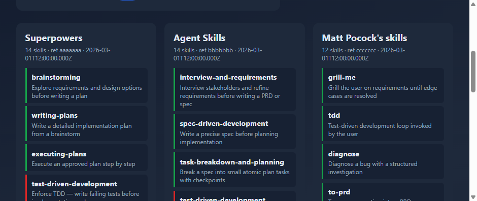

# skillpack

[](https://github.com/Onur45500/skillpack/actions/workflows/ci.yml)
[](LICENSE)
[](https://nodejs.org/)
[](https://www.npmjs.com/package/@onur45500/skillpack)

Recommend and safely combine the three trending meta-skill frameworks for AI coding agents — **[Superpowers](https://github.com/obra/superpowers)**, **[Agent Skills](https://github.com/addyosmani/agent-skills)**, and **[Matt Pocock's skills](https://github.com/mattpocock/skills)** — with one CLI.

`pick` runs a short quiz and prints a primary router plus a conflict-checked cherry-pick list. `map` inventories the packs and reports unique skills, overlaps, and real conflicts (router hooks, auto-invocation trigger overlap, flat-install name collisions).

<p align="center">
  
</p>

## Why this exists

All three frameworks are trending at once. Install two as active routers and you get colliding slash commands, contradictory session-start hooks, and skills fighting over the same intent. Today the only guidance is long blog posts — there is no one-command tool that:

1. Recommends **one** primary framework for your workflow
2. Tells you exactly what you can **safely cherry-pick** from the other two

skillpack fills that gap.

## Install

```bash
npx @onur45500/skillpack pick
npx @onur45500/skillpack map diff
```

Or install globally:

```bash
npm i -g @onur45500/skillpack
skillpack pick
```

## Quick start

```bash
# Opinionated recommendation (bundled snapshot — no network required)
npx @onur45500/skillpack pick

# Non-interactive (CI / demos)
npx @onur45500/skillpack pick --yes --answers examples/barrel-through-solo.json

# Structural diff across the three packs
npx @onur45500/skillpack map diff
npx @onur45500/skillpack map diff --json

# Self-contained HTML report
npx @onur45500/skillpack map html -o skillpack-map.html

# Refresh live data from GitHub (tarball download, no git binary)
npx @onur45500/skillpack map fetch --refresh
```

## Map report

`skillpack map html` writes a single offline HTML file with unique / overlapping / conflicting skills color-coded across all three packs:

<p align="center">
  
</p>

## Commands

| Command | Description |
| --- | --- |
| `skillpack pick` | Interactive quiz → primary router + cherry-picks + install snippets |
| `skillpack pick --yes --answers <file>` | Non-interactive answers JSON |
| `skillpack pick --json` | Emit recommendation as JSON |
| `skillpack map fetch [--refresh]` | Download & parse packs into `~/.cache/skillpack/` |
| `skillpack map diff [--json] [--fail-on-collision]` | Unique / overlapping / conflicts report |
| `skillpack map html [-o path]` | Self-contained HTML report |

## Conflict model

`map` does **not** treat plugin-namespaced commands (e.g. `/superpowers:tdd`) as collisions with `/tdd`. Red findings are:

1. **Router conflict** — two packs both injecting session/process ownership
2. **Flat-install name collision** — same skill name when copied into `~/.claude/skills/`
3. **Auto-invocation trigger overlap** — similar auto-invoked skills fighting for the same intent
4. **Un-namespaced slash-command collision** — exact `/command` matches across packs

## How this stays current

- A **bundled snapshot** (`data/inventory.json`) ships with the package so `pick` works immediately offline.
- `skillpack map fetch --refresh` downloads current GitHub tarballs, parses each pack's real layout, and updates the local cache.
- Every output line that depends on snapshot data includes a **timestamp and source** (`bundled` / `cache` / `live`).
- Scoring weights live in [`src/pick/scoring-rules.ts`](src/pick/scoring-rules.ts); pack URLs and install snippets live in [`src/config/packs.ts`](src/config/packs.ts). PRs welcome as the frameworks evolve.

## Development

```bash
git clone https://github.com/Onur45500/skillpack.git
cd skillpack
npm install
npm test
npm run build
npm run regenerate-snapshot   # network required
```

See [CONTRIBUTING.md](CONTRIBUTING.md) for how to add quiz questions, update pack config, and regenerate the bundled snapshot.

### Suggested GitHub topics

When you configure the repo on GitHub, add: `cli`, `claude-code`, `agent-skills`, `cursor`, `typescript`, `superpowers`.

## License

MIT © [Onur45500](https://github.com/Onur45500)
